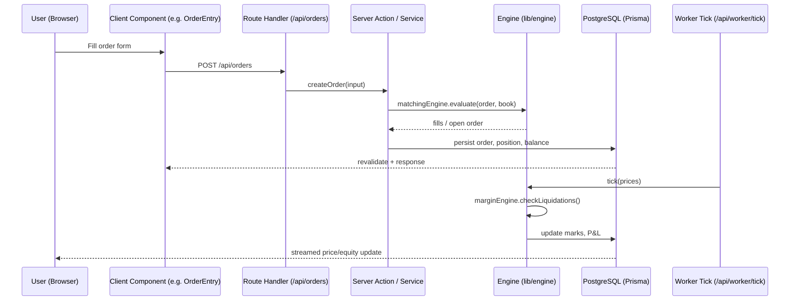

# Architecture

This document explains how the Kraken Trading Simulator is structured, the core
abstractions, and the request/data flow. Read this before making non-trivial
changes so your work lands in the right layer.

## At a glance

- **Framework:** Next.js 16 (App Router), React 19, TypeScript (strict).
- **Database:** PostgreSQL via Prisma 7 (client generated at build/dev time).
- **Auth:** `better-auth` (email/password) with the Prisma adapter.
- **State:** Server Components by default; client state via Zustand for the
  trading UI; server state via Route Handlers + React Server Components.
- **Simulation:** A pure, side-effect-free trading **engine** (`lib/engine`)
  that is fully unit-testable without a database or network.
- **Prices:** A `SimulatedPriceFeed` (Geometric Brownian Motion) — no real
  exchange connection, virtual money only.

## Request / data flow

Key idea: **the engine never talks to the network or DB directly.** Services
(`server/actions/*`) orchestrate: validate input (Zod) → call engine → persist
via Prisma. This keeps the engine deterministic and testable.

## Core abstractions (where to put code)

| Concern                    | Location                                                                          | Notes                                                                               |
| -------------------------- | --------------------------------------------------------------------------------- | ----------------------------------------------------------------------------------- |
| Order matching             | `lib/engine/matchingEngine.ts`                                                    | Pure function: `(order, book) => result`. No I/O.                                   |
| Margin / P&L / liquidation | `lib/engine/marginEngine.ts`                                                      | Pure. Used by worker tick + position close.                                         |
| Price sources              | `lib/engine/priceFeed/PriceFeedProvider.ts` (interface) + `SimulatedPriceFeed.ts` | Implement the interface to add a new feed.                                          |
| Validation                 | `lib/validation/orderSchemas.ts`                                                  | Zod schemas — single source of truth for API + UI.                                  |
| DB access                  | `lib/prisma.ts`                                                                   | Singleton client. Never import Prisma outside services.                             |
| Business services          | `server/actions/*.ts`                                                             | `orders.ts`, `positions.ts`, `portfolio.ts`. The only place that mixes engine + DB. |
| HTTP surface               | `app/api/**/route.ts`                                                             | Thin: parse → call service → serialize. No business logic.                          |
| UI                         | `app/(main)/**`, `components/**`                                                  | Server Components by default; `"use client"` only when interactive.                 |

## Adding a new order type

1. Add the variant to the domain types in `lib/engine/types.ts`.
2. Implement evaluation in `matchingEngine.ts` (pure, no I/O).
3. Add a Zod schema in `lib/validation/orderSchemas.ts`.
4. Cover both with unit tests (`*.test.ts` next to the file) using known inputs.
5. Wire the UI in `components/trade/OrderEntry.tsx` and the API in
   `app/api/orders/route.ts` (which should just call the existing service).

## Adding a new indicator / price feed

Implement `PriceFeedProvider` and register it where the feed is selected. Keep
the engine pure; inject prices in.

## Background work

`app/api/worker/tick/route.ts` is called on an interval (see
`components/WorkerTick.tsx`) to advance simulated prices and evaluate
liquidations. It must remain idempotent and DB-backed so restarts are safe.

## Conventions that protect the architecture

- Route handlers stay thin; all logic lives in `server/actions` or `lib/engine`.
- The engine is pure — if you need `await` or `fetch` in `lib/engine`, it
  probably belongs in a service instead.
- Validation happens once, at the boundary, via Zod.
